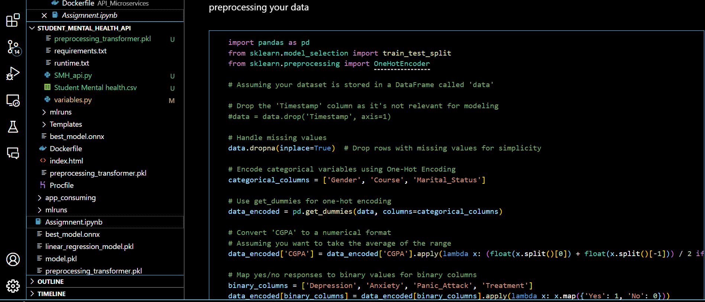
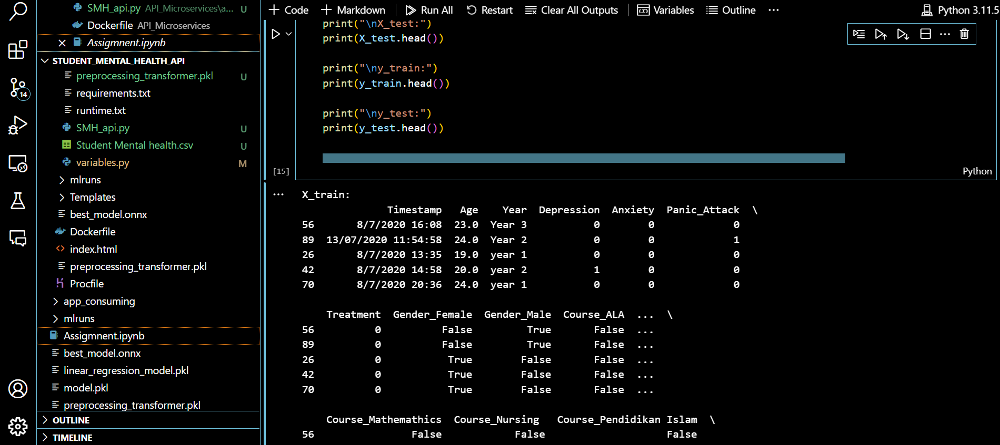

# Assignment_
MLOps and Cloud Native  AI/ML: Data and Machine  learning operationalization :
Student Mental health

# Student Mental Health Prediction API

This API provides predictions for Student Mental Health based on various features. The prediction model has been trained on a dataset containing information about students' gender, age, course, year, CGPA, marital status, depression, anxiety, panic attack, and treatment.

## Getting Started

These instructions will help you set up the API on your local machine for testing and development purposes.

### Prerequisites

Make sure you have the following installed on your machine:

- [Python](https://www.python.org/) (version 3.6 or higher)
- [FastAPI](https://fastapi.tiangolo.com/) (for creating the API)
- [uvicorn](https://www.uvicorn.org/) (ASGI server for running FastAPI)
- [onnxruntime](https://onnxruntime.ai/) (for running ONNX models)
- [scikit-learn](https://scikit-learn.org/) (for machine learning models)

### Installation

1. **Clone this repository:**

   ```bash
   git clone https://github.com/your-username/Student-Mental-Health-API.git
   **
**Navigate to the project directory:**
**
cd Student-Mental-Health-API

****Install dependencies:**
pip install -r requirements.txt

**Preprocessing**
The dataset preprocessing involves handling missing values, encoding categorical variables, and scaling numerical features. The preprocessing steps are encapsulated in the preprocessing_transformer.pkl file. This transformer is loaded during API initialization.

**Training**
The machine learning models are trained using the following steps:

Load the Dataset:
Assuming your dataset is loaded as data, separate features and the target variable:
X = data.drop(['Timestamp', 'CGPA'], axis=1)
y = data['CGPA']




**Preprocessing:**

Perform any necessary preprocessing on 'X'. For simplicity, we'll use pandas get_dummies for categorical encoding:

X = pd.get_dummies(X)

**Split the Data:
Split the data into training and testing sets:


from sklearn.model_selection import train_test_split
X_train, X_test, y_train, y_test = train_test_split(X, y, test_size=0.2, random_state=42)

Train 5 machine learning models:
* Model 1: Linear Regression
linear_reg_model = LinearRegression()
linear_reg_model.fit(X_train, y_train)

* Model 2: Decision Tree Regression
decision_tree_model = DecisionTreeRegressor()
decision_tree_model.fit(X_train, y_train)

* Model 3: Random Forest Regression
random_forest_model = RandomForestRegressor()
random_forest_model.fit(X_train, y_train)

* Model 4: Support Vector Regression
svr_model = SVR()
svr_model.fit(X_train, y_train)

* Model 5: XGBoost Regression (replace Gradient Boosting)
xgboost_model = XGBRegressor()
xgboost_model.fit(X_train, y_train)

Evaluate Models:
Evaluate the models using appropriate metrics:

models = [linear_reg_model, decision_tree_model, random_forest_model, svr_model, xgboost_model]
model_names = ['Linear Regression', 'Decision Tree', 'Random Forest', 'SVR', 'XGBoost']

for model, name in zip(models, model_names):
    y_pred = model.predict(X_test)
    mse = mean_squared_error(y_test, y_pred)
    r2 = r2_score(y_test, y_pred)
    explained_var = explained_variance_score(y_test, y_pred)

    print(f"\n{name} Model:")
    print(f"Mean Squared Error: {mse:.2f}")
    print(f"R-squared: {r2:.2f}")
    print(f"Explained Variance: {explained_var:.2f}")

  # Usage
1. Start the FastAPI server:

uvicorn main:app --reload
This will start the API at http://127.0.0.1:8000.
2. Access the API documentation:
Open your browser and go to http://127.0.0.1:8000/docs to explore the API and make predictions.
3. Make predictions:
Use the provided API endpoints to make predictions based on student data.
# API Endpoints
/: Provides a welcome message and instructions.
/predict: Accepts student data as input and returns predictions for Student Mental Health.
# Models
The API uses a machine learning model for prediction, stored in ONNX format. The preprocessing steps are handled by a saved preprocessing transformer.
# Use the tiangolo/uvicorn-gunicorn-fastapi image as the base image
FROM tiangolo/uvicorn-gunicorn-fastapi:python3.9

# Copy the contents of the local 'app' directory into the '/app' directory in the container
COPY ./app /app

# Install dependencies listed in the 'requirements.txt' file
RUN pip install -r requirements.txt

# Expose port 80 to the outside world
EXPOSE 80

# Set the command to run the UVicorn server with the specified host and port
CMD ["uvicorn", "SMH:app", "--host", "0.0.0.0", "--port", "80"]


This Dockerfile assumes that the FastAPI application is structured in a way that the SMH(Student Mental health) module contains the app FastAPI instance.

## Flask Part 
from flask import Flask, render_template, request

app = Flask(__name__)

# Define the home route
@app.route('/')
def home():
    return render_template('your_html_file.html', prediction='')

# Define the predict route
@app.route('/predict', methods=['POST'])
def predict():
    # Get form data
    gender = request.form['gender']
    age = float(request.form['age'])
    course = request.form['course']
    year = request.form['year']
    cgpa = request.form['cgpa']

    # Perform any necessary preprocessing on the input data
    # Call your prediction function here using the input data
    # For example, prediction = predict_cgpa(gender, age, course, year, cgpa)

    # For now, let's assume a placeholder prediction
    prediction = "Placeholder Prediction"

    # Render the HTML template with the prediction
    return render_template('your_html_file.html', prediction=prediction)

if __name__ == '__main__':
    app.run(debug=True)
    
and i get this : 


